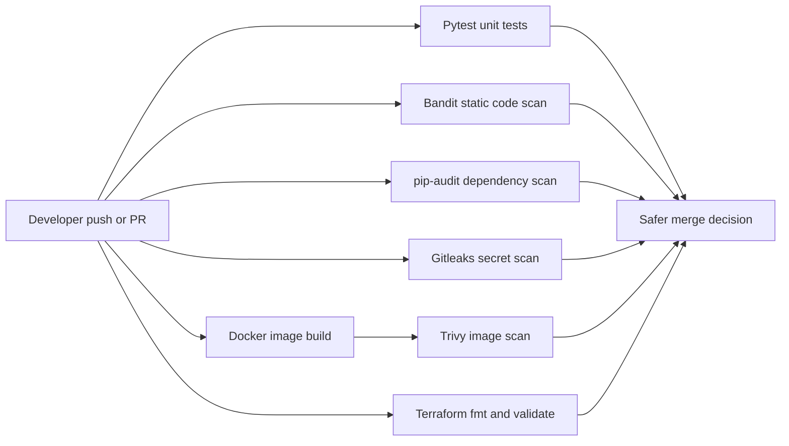

# DevSecOps Secure Pipeline

A portfolio-ready DevSecOps project that demonstrates a secure CI/CD pipeline for a containerized Flask application. The pipeline runs unit tests, Docker image scanning, dependency scanning, secret scanning, and Terraform validation.

This project is intentionally small so each security control is easy to inspect and explain during interviews.

## DevSecOps Pipeline



## What This Project Demonstrates

- Flask app with `/`, `/health`, and `/version` routes.
- Pytest coverage for every route.
- Secure Dockerfile using a slim base image, non-root user, and healthcheck.
- Separate GitHub Actions workflows for each security gate.
- Trivy scan for Docker image vulnerabilities.
- Bandit scan for common Python security issues.
- pip-audit scan for vulnerable Python dependencies.
- Gitleaks scan for committed secrets.
- Terraform validation for AWS EC2-style infrastructure.
- Clear beginner-friendly documentation and security explanations.

## Folder Structure

```text
devsecops-secure-pipeline/
├── .github/workflows/
│   ├── code-security.yml
│   ├── docker-security.yml
│   ├── secrets-scan.yml
│   ├── terraform-validate.yml
│   └── test.yml
├── app/
│   ├── __init__.py
│   └── main.py
├── terraform/
│   ├── .terraform.lock.hcl
│   ├── main.tf
│   ├── outputs.tf
│   ├── variables.tf
│   └── versions.tf
├── tests/
│   └── test_app.py
├── .dockerignore
├── .env.example
├── .gitignore
├── Dockerfile
├── README.md
├── SECURITY.md
├── requirements-dev.txt
└── requirements.txt
```

## Tools Used

| Tool | Purpose |
| --- | --- |
| Flask | Small Python web app used as the pipeline target |
| Pytest | Unit tests for application routes |
| Docker | Builds a deployable container image |
| GitHub Actions | Runs CI/CD and security checks automatically |
| Trivy | Scans Docker images for operating system and package vulnerabilities |
| Bandit | Finds common insecure Python coding patterns |
| pip-audit | Checks Python dependencies against vulnerability databases |
| Gitleaks | Detects accidentally committed credentials and tokens |
| Terraform | Validates infrastructure-as-code formatting and syntax |

## API Endpoints

| Endpoint | Description |
| --- | --- |
| `/` | Returns a welcome message and available endpoints |
| `/health` | Healthcheck used by Docker and monitoring tools |
| `/version` | Shows app version, environment, and hostname |

## Run Locally

1. Create a virtual environment:

   ```sh
   python -m venv .venv
   source .venv/bin/activate
   ```

2. Install dependencies:

   ```sh
   pip install -r requirements.txt -r requirements-dev.txt
   ```

3. Start the Flask app:

   ```sh
   flask --app app.main run --host 0.0.0.0 --port 5000
   ```

4. Test the endpoints:

   ```sh
   curl http://localhost:5000/
   curl http://localhost:5000/health
   curl http://localhost:5000/version
   ```

## Run With Docker

Build the image:

```sh
docker build --tag devsecops-secure-pipeline:local .
```

Run the container:

```sh
docker run --rm -p 5000:5000 devsecops-secure-pipeline:local
```

Check health:

```sh
curl http://localhost:5000/health
```

Expected output:

```json
{"status":"ok"}
```

## Run Tests Locally

```sh
pytest -q
```

Expected output:

```text
3 passed
```

## Run Security Scans Locally

Install development dependencies first:

```sh
pip install -r requirements.txt -r requirements-dev.txt
```

Run Bandit:

```sh
bandit -r app -ll
```

Run pip-audit:

```sh
pip-audit -r requirements.txt
```

Run Gitleaks:

```sh
gitleaks detect --source . --verbose
```

Run Trivy against the local image:

```sh
docker build --tag devsecops-secure-pipeline:local .
trivy image --severity HIGH,CRITICAL --ignore-unfixed devsecops-secure-pipeline:local
```

Validate Terraform:

```sh
terraform -chdir=terraform fmt -check -recursive
terraform -chdir=terraform init -backend=false
terraform -chdir=terraform validate
```

## GitHub Actions Workflows

| Workflow | File | What it checks |
| --- | --- | --- |
| Tests | `.github/workflows/test.yml` | Installs dependencies and runs pytest |
| Docker Security | `.github/workflows/docker-security.yml` | Builds the image and scans it with Trivy |
| Code Security | `.github/workflows/code-security.yml` | Runs Bandit and pip-audit |
| Secrets Scan | `.github/workflows/secrets-scan.yml` | Runs Gitleaks against the repository history |
| Terraform Validate | `.github/workflows/terraform-validate.yml` | Runs Terraform fmt, init, and validate |

## How To Fix Common Scan Failures

### Pytest failure

- Reproduce locally with `pytest -q`.
- Read the failing assertion.
- Fix the app route or update the test if expected behavior changed intentionally.

### Bandit failure

Bandit flags insecure Python patterns such as unsafe shell execution, weak cryptography, or dangerous deserialization.

- Avoid `shell=True` unless there is a documented reason.
- Do not use `eval` or `exec`.
- Validate and sanitize user input.

### pip-audit failure

pip-audit reports vulnerable Python packages.

- Upgrade the vulnerable package in `requirements.txt`.
- Re-run `pip-audit -r requirements.txt`.
- If no fixed version exists, document the risk and consider replacing the package.

### Gitleaks failure

Gitleaks usually means a credential-like value was committed.

- Remove the credential from the file.
- Rotate the credential in the provider where it was created.
- Keep only safe placeholders in `.env.example`.

### Trivy failure

Trivy can find vulnerabilities in the base image or installed packages.

- Rebuild with the latest base image using `docker build --pull`.
- Upgrade vulnerable dependencies.
- Prefer slim, minimal images.

### Terraform failure

- Run `terraform fmt -recursive`.
- Run `terraform validate`.
- Check variable types, resource arguments, and provider version constraints.

## Security Notes

- This repo intentionally contains no real secrets.
- Use `.env.example` for safe examples only.
- Put local-only values in `.env`, which is ignored by Git.
- Terraform state and variable files are ignored by Git.
- The Docker container runs as a non-root user.
- GitHub Actions permissions are restricted to the minimum needed for each workflow.

## Terraform Design

The Terraform folder defines validation-friendly AWS EC2 infrastructure:

- Configurable AWS region.
- EC2 instance type variable with validation.
- AMI ID variable with validation.
- Security group for HTTP traffic.
- EC2 instance resource with tags.

The configuration is intended for validation and portfolio review. Before applying it in a real AWS account, restrict ingress CIDR ranges, configure remote state, and review cost/security impact.

## Resume Bullet Points

- Built a DevSecOps CI/CD pipeline using GitHub Actions for unit testing, Docker image scanning, dependency scanning, secret scanning, and Terraform validation.
- Secured a containerized Flask application with a minimal Python base image, non-root execution, Docker healthcheck, and clean build context.
- Integrated Trivy, Bandit, pip-audit, and Gitleaks to detect vulnerabilities across container images, application code, dependencies, and repository history.
- Created validation-friendly Terraform AWS EC2 infrastructure with typed variables, input validation, and formatting checks.
- Documented common security scan failures and remediation steps for maintainable team handoff.
